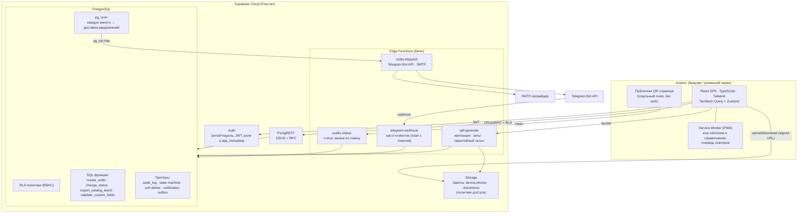
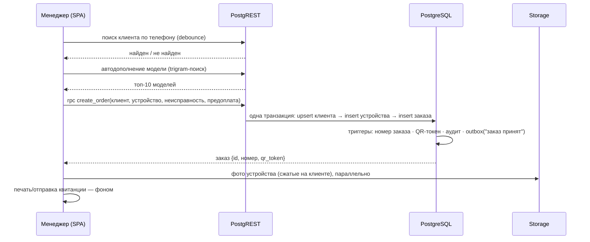
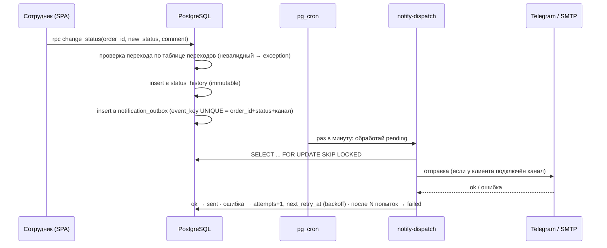
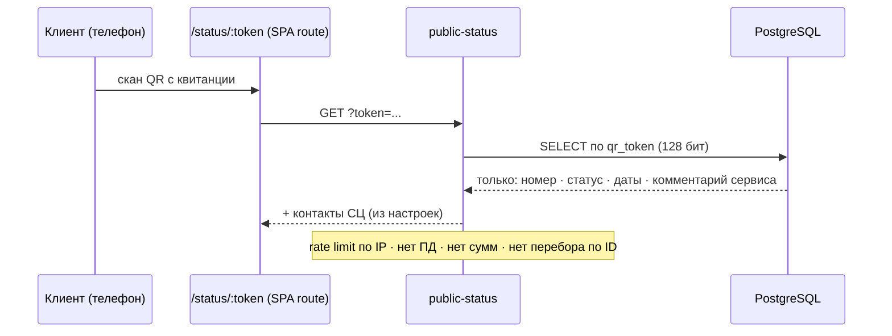

# ЭТАП 2: Проектирование архитектуры

> Статус: **на утверждении**.
> Утверждённые на Этапе 1 решения: 1 заказ = 1 устройство · бесплатное развёртывание (Supabase Cloud Free) · одна точка приёма · финансы — учёт + способ оплаты · каналы уведомлений: Telegram, Email, телефон (ручной звонок).

---

## 1. Архитектура в одном абзаце

Клиентское приложение — **React SPA (PWA)**, общается с **Supabase** напрямую: данные через PostgREST с RLS-политиками, транзакционная бизнес-логика — в **функциях PostgreSQL (RPC)**, фоновые и «недоверенные» операции (отправка уведомлений, генерация PDF, публичная QR-страница) — в **Edge Functions**. Вся защита — на уровне БД (RLS + триггеры), UI лишь отражает права. Уведомления идут через **outbox-таблицу** с доставкой по расписанию (pg_cron → Edge Function), что даёт идемпотентность и устойчивость к сбоям каналов.

## 2. Компонентная схема



## 3. Карта сервисов Supabase

| Сервис | Что делает в проекте | Почему так |
|---|---|---|
| **Auth** | Вход email+пароль; JWT; роль (`admin`/`manager`/`master`) — в `app_metadata`, дублируется в таблице `profiles` | `app_metadata` нельзя изменить с клиента → роли читаются RLS-политиками прямо из JWT без лишнего join |
| **PostgREST** | Все чтения и простые записи (клиенты, справочники, комментарии) | Нет своего API-сервера = нечего хостить и нечему падать; защита — RLS |
| **SQL-функции (RPC)** | Транзакционные сценарии: создание заказа (клиент+устройство+заказ одним вызовом), смена статуса, пакетный импорт справочника | Атомарность и валидация в одном месте — в БД; невозможно обойти из клиента |
| **Триггеры** | Аудит, state machine, защита от удаления (soft delete), запись событий в outbox | Срабатывают при любом пути записи — даже если появится второй клиент API |
| **Storage** | `device-photos` (фото устройства/серийника), `documents` (PDF, чеки, гарантийные документы) — оба private, доступ по политикам и signed URL | Раздельные бакеты = раздельные политики и лимиты типов файлов |
| **Edge Functions** | 4 функции: `notify-dispatch`, `pdf-generate`, `public-status`, `telegram-webhook` | Только то, что нельзя/опасно делать в браузере или SQL: секреты каналов, рендер PDF, публичный доступ |
| **pg_cron + pg_net** | Раз в минуту дёргает `notify-dispatch` для разбора outbox; ретраи с backoff | Доступны на Free tier; не нужен внешний планировщик |

## 4. Потоки данных ключевых сценариев

### 4.1. Создание заказа (< 60 секунд со смартфона)



### 4.2. Смена статуса → уведомление (идемпотентно)



Идемпотентность: уникальный `event_key` — одно событие физически не может породить две записи; `SKIP LOCKED` — два параллельных запуска не возьмут одну запись.

### 4.3. Публичная QR-страница



### 4.4. Импорт справочника (десятки тысяч строк)

Файл **парсится на клиенте** (SheetJS/PapaParse) → нормализация (trim, регистр) → пачки по 500 строк → `rpc import_catalog_batch(rows)` → upsert по ключу `(категория, бренд, модель)` → построчный отчёт ошибок. Прогресс-бар на клиенте, дешёвый dry-run первой пачки.
*Почему не Edge Function:* лимиты памяти/времени на Free tier; на клиенте — бесплатно, с прогрессом и без таймаутов.

## 5. Ключевые решения и обоснование

| № | Решение | Альтернатива отклонена потому что |
|---|---|---|
| Р1 | **Без собственного backend-сервера**: PostgREST + RPC + Edge Functions | Node/Nest-сервер: нечем бесплатно хостить 24/7, лишний слой, дольше до запуска |
| Р2 | **Бизнес-правила в БД** (state machine, валидация динpolей — триггеры/функции) | Логика в клиенте обходится через прямой API-вызов; в БД — нет |
| Р3 | **Динамические поля**: таблица шаблонов на категорию + **JSONB** у устройства, валидация триггером по шаблону | Классический EAV: 3 join'а на каждое чтение, расползание типов; отдельные колонки: миграция на каждое поле |
| Р4 | **Outbox + pg_cron** для уведомлений | Отправка прямо из триггера/запроса: сбой канала ломает смену статуса; очередь во внешнем брокере: не бесплатно |
| Р5 | **Роль в JWT `app_metadata`** + зеркало в `profiles` | Роль только в таблице: каждый RLS-чек = join; только в JWT: нечего показать в UI списка сотрудников |
| Р6 | **PDF в Edge Function** (HTML-шаблон → PDF) с сохранением в Storage | Печать из браузера (window.print): нет файла для повторной выдачи/отправки; клиентский jsPDF: кириллица и макеты болезненны |
| Р7 | **Поиск**: `pg_trgm` + GIN по моделям, брендам, клиентам, серийникам | Внешний поиск (Meilisearch и т.п.): второй сервис, не бесплатно, синхронизация |
| Р8 | **Frontend-хостинг**: статика на Cloudflare Pages / Vercel (free) + **Dockerfile (nginx)** как самодостаточная альтернатива | Только Docker: нужен VPS (не бесплатно); только хостинг: нарушает требование стека «Docker» |
| Р9 | **Один проект Supabase** (prod); dev — локальный `supabase start` (Docker) | Второй облачный проект под dev сжигает лимит бесплатных проектов и может быть приостановлен |
| Р10 | **«Телефон» как ручной канал**: кнопка click-to-call (`tel:`) + отметка «уведомлён звонком» (кто/когда) в истории заказа | Автообзвон/SMS-шлюзы — платные; ручной звонок и так есть в процессе, фиксируем факт |

## 6. Ограничения Supabase Free tier и как мы в них живём

| Лимит | Значение | Митигация |
|---|---|---|
| База данных | 500 MB | Текстовые данные СЦ — мегабайты в год; фото в Storage, не в БД; аудит — компактный JSONB-diff |
| Storage | 1 GB | Сжатие фото на клиенте до ~1920px/~250KB → ~4000 фото; PDF регенерируемы из данных; политика очистки фото выданных заказов (настраивается) |
| Edge Functions | 500K вызовов/мес | Cron раз в минуту ≈ 43K + уведомления/PDF — двузначный запас |
| **Пауза проекта после 7 дней неактивности** | критично | При ежедневной работе СЦ недостижимо; для подстраховки — GitHub Actions cron-пинг (бесплатно) |
| Auth-пользователи | 50K MAU | 1–10 сотрудников |
| Бэкапы на Free | нет автоматических | GitHub Actions: ночной `pg_dump` в приватный репозиторий/артефакт (этап «Деплой») |

**Честный trade-off:** Free tier — это старт «за 0 ₽», а не SLA. Если сервис станет критичным — апгрейд на Pro ($25/мес) без единого изменения в коде. Архитектура не привязана к тарифу.

## 7. Структура репозитория (целевая)

```
Crm/
├── docs/                  # этапы проектирования, диаграммы
├── supabase/
│   ├── migrations/        # DDL: таблицы, индексы, RLS, триггеры, функции
│   ├── functions/         # Edge Functions (notify-dispatch, pdf-generate, public-status, telegram-webhook)
│   └── seed.sql           # стартовые данные (статусы-переходы, демо-справочник)
├── src/                   # React SPA
│   ├── app/               # роутинг, провайдеры, layout
│   ├── features/          # orders, clients, catalog, dashboard, settings, public-status
│   ├── shared/            # api-клиент, ui-kit, hooks, утилиты
│   └── pwa/               # manifest, service worker
├── docker/                # Dockerfile (nginx), docker-compose (self-hosted вариант)
└── .github/workflows/     # CI, бэкап, анти-пауза пинг
```

## 8. Риски этапа

- **pg_cron/pg_net на Free tier**: доступны, но интервал раз в минуту = уведомление приходит с задержкой до ~60 сек. Приемлемо для СЦ; при необходимости — прямой вызов dispatch после смены статуса (cron остаётся страховкой).
- **PDF в Edge Function**: рендер кириллицы требует встраивания шрифтов в шаблон — закладываем сразу (этап PDF).
- **Telegram opt-in**: конверсия подключений неизвестна; Email + звонок остаются гарантированными каналами.

## 9. Что будет на следующем этапе

**Этап 3 — Проектирование БД:** полная модель данных (все таблицы и связи), стратегия динамических полей и справочников в деталях, нормализация, стратегия индексации (включая trigram), схема аудита и soft delete, таблица переходов статусов.

## 10. ⏸️ СТОП

Жду подтверждения для перехода к Этапу 3 («продолжай» / точечные правки).
