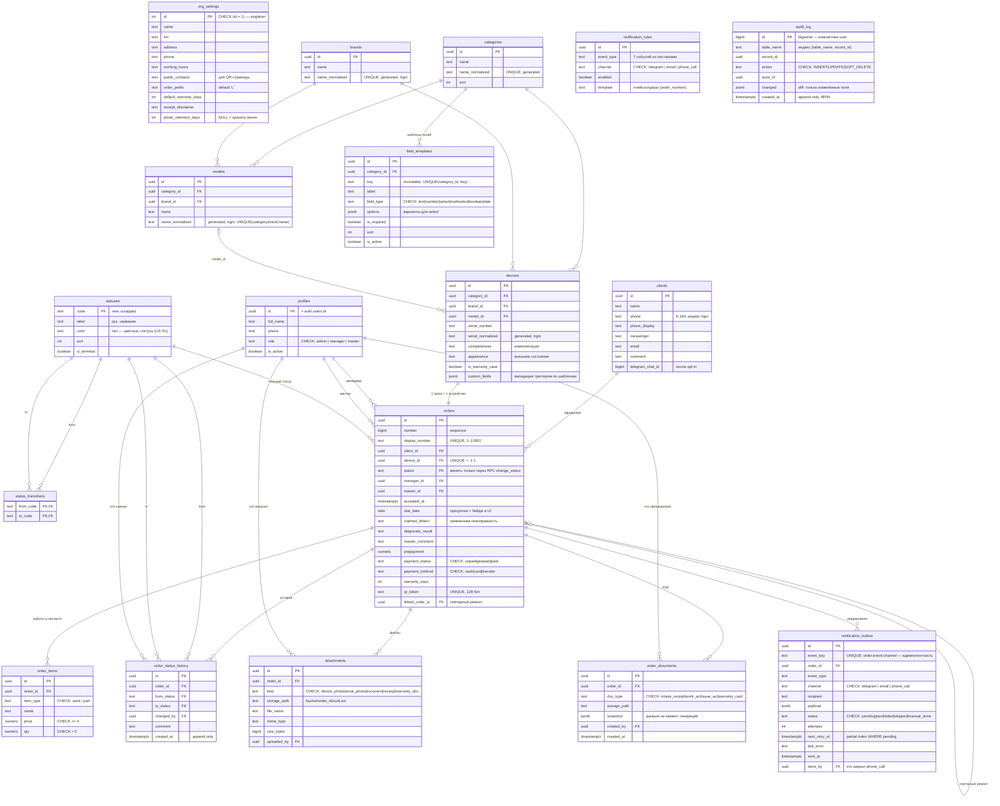

# ЭТАП 4: ER-диаграмма

> Статус: **на утверждении**.
> Диаграмма покрывает все таблицы Этапа 3. Для читаемости на диаграмме опущены служебные колонки `created_at` / `updated_at` (есть во всех таблицах) и `deleted_at` / `deleted_by` (есть во всех таблицах с пользовательскими данными: clients, categories, brands, models, field_templates, devices, orders, order_items, attachments).

**Уточнение к Этапу 3:** простые перечисления без UI-атрибутов (`role`, `field_type`, `payment_status`, `payment_method`, `item_type`, `kind`, `doc_type`, `channel`, статусы outbox) реализуются **CHECK-ограничениями**, а не справочными таблицами — им не нужны редактируемые подписи. Отдельной таблицей остаются только `statuses` (нужны label, цвет, порядок — UX-N1) и `status_transitions` (правила переходов = данные).

---

## Диаграмма

`audit_log`, `org_settings` и `notification_rules` связей-стрелок не имеют намеренно: аудит полиморфен (`table_name` + `record_id`, без FK — журнал не должен мешать ничему и зависеть ни от чего), настройки — singleton, правила уведомлений — конфигурация по `event_type`.

## Контрольная сверка с требованиями постановки

| Требование | Покрыто |
|---|---|
| Клиент: имя·телефон·мессенджер·email·комментарий | `clients` |
| Устройство: категория·бренд·модель·серийник·комплектация·состояние·гарантийный случай·фото | `devices` + `attachments(kind)` |
| Неисправность: заявленная·диагностика·работы·комментарий мастера | `orders.claimed_defect / diagnostic_result / master_comment` + `order_items(work)` |
| Заказ: номер·дата приёма·план готовности·статус·мастер·менеджер | `orders` |
| Финансы: работы·запчасти·предоплата·итог·статус оплаты | `order_items` + `orders.prepayment/payment_*` + view итогов |
| State machine + история смен | `statuses`, `status_transitions`, `order_status_history` |
| Динамические справочники + импорт | `categories/brands/models` + UNIQUE-ключ для upsert |
| Динамические поля без миграций | `field_templates` + `devices.custom_fields` |
| QR по токену | `orders.qr_token` |
| Аудит неизменяемый, soft delete | `audit_log`, `deleted_at/deleted_by` |
| Идемпотентные уведомления | `notification_outbox.event_key UNIQUE` |
| PDF-документы | `order_documents` + snapshot |

## Что будет на следующем этапе

**Этап 5 — SQL-схема**: полный DDL одним артефактом — расширения (pg_trgm, pg_cron), таблицы, CHECK/FK, generated-колонки, все индексы, триггеры (аудит, soft delete, state machine, валидация custom_fields, outbox), функции (`create_order`, `change_status`, `import_catalog_batch`, `quick_add_model`, `global_search`), view `orders_with_totals`, RLS-политики всех таблиц, seed (статусы, переходы, правила уведомлений).

## ⏸️ СТОП

Жду подтверждения для перехода к Этапу 5.
